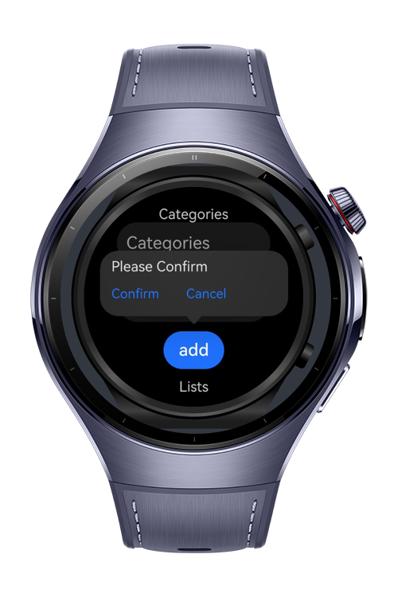

> **Note:** To access all shared projects, get information about environment setup, and view other guides, please visit [Explore-In-HMOS-Wearable Index](https://github.com/Explore-In-HMOS-Wearable/hmos-index).

# How To Make Button Popup

This code lab shows how to use popup functionality for HarmonyOS devices

# Preview

<div>    
  
  
</div> 

# Use Cases

- Users can enter the item category and amount to see the related confirmation popup

# Tech Stack

- **Languages**: ArkTS
- **Frameworks**: HarmonyOS SDK 5.1.0(18)
- **Tools**: DevEco Studio Vers 5.1.0.842
- **Libraries**: @kit.ArkUI

# Directory Structure

   ```
   entry/src/main/ets/
    ├── pages/      
    │ ├── Index.ets                           // Home Page
   ```

# Constraints and Restrictions
## Suported Devices
- Huawei Watch 5

# License
**PopUp** is distributed under the terms of the MIT License
See the [LICENSE](./LICENSE) for more information.
